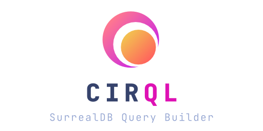
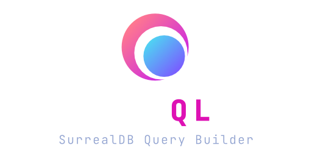

<br>

<div align="center">
	<a href="#gh-light-mode-only">
		
	</a>
	<a href="#gh-dark-mode-only">
		
	</a>
</div>

<hr />

<br>

<p align="center">
  <a href="https://github.com/StarlaneStudios/cirql/blob/master/LICENSE">
     
  </a>
  <a href="https://discord.gg/exaQDX2">
  	
  </a>
  
  
</p>

Cirql (pronounced Circle) is a simple and lightweight query builder for [SurrealDB](https://surrealdb.com/) with built in model mapping and validation powered by [Zod](https://github.com/colinhacks/zod).

## Features
- 🔗 Connect directly to SurrealDB without dependencies
- 📦 Chain queries for batching & transactions
- ⚙️ Zod-powered schema validation of query results
- 📝 Full TypeScript support with Zod schema inference

## Notice
Cirql is still in early developmental stages. While you can use it for production applications, it may still lack specific features and edge cases. Feel free to submit feature requests or pull requests to add additional functionality to Cirql. We do ask you to please read our [Contributor Guide](CONTRIBUTING.md).

While we try to prevent making any significant API changes, we cannot guarantee this.

## Getting started
The first step to use Cirql is to install the package from npm
```
npm install cirql zod
```

You can now instantiate a Cirql instance which will automatically attempt to connect to SurrealDB. If you require manual control over connecting you can disable auto connect in the options.

```ts
import { Cirql } from 'cirql';

const cirql = new Cirql({
	connection: {
		endpoint: 'http://localhost:8000/',
		username: 'root',
		password: 'root',
		namespace: 'test',
		database: 'test',
	}
});
```

Once you have your cirql connection opened, you will be able to execute queries on the database. While you can use `cirql.query()` to send any query to SurrealDB, Cirql provides additional easy to use functions for common operations.

```ts
// Define a schema using Zod
const UserProfile = z.object({
	firstName: z.string(),
	lastName: z.string(),
	email: z.string(),
	age: z.number()
});

// Select all user profiles
const profiles = cirql.selectMany({ 
	query: 'SELECT * FROM profile',
	schema: UserProfile
});
```

### Batch queries
You can send multiple queries in a single request by chaining multiple operations together after using the `.prepare()` function. The execute function will return a spreadable array containing all query results.

```ts
const [profiles, total, john] = cirql.prepare()
	.selectMany({ 
		query: 'SELECT * FROM profile',
		schema: UserProfile
	})
	.count({
		table: 'userProfile'
	})
	.create({
		table: 'userProfile',
		schema: UserProfile,
		data: {
			firstName: 'John',
			localhost: 'Doe',
			email: 'john@example.com',
			age: 42
		}
	})
	.execute();
```

If you would like to run the batched queries as transaction instead, simply replace `.execute()` with `.transaction()`.

## Contributing
We welcome any issues and PRs submitted to Cirql. Since we currently work on multiple other projects and our time is limited, we value any community help in supporting a rich future for Cirql.

Before you open an issue or PR please read our [Contributor Guide](CONTRIBUTING.md).

### Requirements
- [PNPM](https://pnpm.io/) (npm i -g pnpm)

### Roadmap
You can find the roadmap of intended features [here](ROADMAP.md).

### Live Development
To run in live development mode, run `pnpm dev` in the project directory. This will start the Vite development server.

## Maintainers
<a href="https://starlane.studio#gh-light-mode-only">
  
</a>
<a href="https://starlane.studio#gh-dark-mode-only">
  
</a>

Cirql is built and maintained by <a href="https://starlane.studio/">Starlane Studios</a> at no cost. If you would like to support our work feel free to [donate to us](https://paypal.me/ExodiusStudios) ⚡

## License

Cirql is licensed under [MIT](LICENSE)

Copyright (c) 2022, Starlane Studios