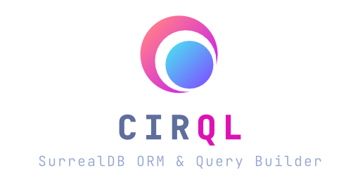

<br>

<div align="center">
	
</div>

<hr />

<br>

<p align="center">
  <a href="https://github.com/StarlaneStudios/cirql/blob/master/LICENSE">
     
  </a>
  <a href="https://discord.gg/exaQDX2">
      
  </a>
  
  
</p>

Cirql (pronounced Circle) is a simple and lightweight ORM and query builder for [SurrealDB](https://surrealdb.com/) with built in model mapping and validation powered by [Zod](https://github.com/colinhacks/zod). Unlike most query builders, Cirql takes a very open approach, providing you with complete control over your queries.

## Features
- 🔗 Connect to SurrealDB over stateful WebSockets or stateless requests
- 📦 Immutable query chaining for batching & transactions
- ⚙️ Zod-powered schema validation of query results
- 📝 Full TypeScript support with Zod schema inference
- 💎 Write flexible queries using strings or via chained functions

## Notice
Cirql is still in early developmental stages. While you can use it for production applications, it may still lack specific features and edge cases. Feel free to submit feature requests or pull requests to add additional functionality to Cirql. We do ask you to please read our [Contributor Guide](CONTRIBUTING.md).

While we try to prevent making any significant API changes, we cannot guarantee this.

## Installation
The first step to use Cirql is to install the package from npm, together with a supported version of zod.
```
npm install cirql zod
```

## Getting started
### Navigation
- [Connecting to SurrealDB](#connecting-to-surrealdb)
- [String based queries](#string-based-queries)
- [Result validation & TypeScript typings](#result-validation--typescript-typings)
- [Simplified create & update queries](#simplified-create--update-queries)
- [Writing programmatic queries](#writing-programmatic-queries)
- [Batched queries & transactions](#batched-queries--transactions)
- [Stateless requests](#stateless-requests)

### Connecting to SurrealDB
You can now instantiate a Cirql instance which will automatically attempt to connect to SurrealDB. If you require manual control over connecting you can disable auto connect in the options.

```ts
import { Cirql } from 'cirql';

const cirql = new Cirql({
    connection: {
        endpoint: 'http://localhost:8000/',
        namespace: 'test',
        database: 'test',
    },
	credentials: {
		user: 'root',
        pass: 'root',
	}
});
```

### String based queries
Once you have your cirql connection opened, you will be able to execute queries on the database. 

```ts
const profiles = await cirql.selectMany({ 
    query: 'SELECT * FROM profile WHERE age > $minAge',
    params: {
        minAge: 42
    }
});
```

In order to prevent potential SQL injection attacks avoid inserting user-generated variables directly into your queries. Instead, make use of Surreal's parameter functionality as demonstrated above.

If you need more control over your query you can also use the `query()` function to send any query string with no limitations.

### Result validation & TypeScript typings
By utilizing zod, Cirql is able to efficiently validate query responses against predefined schemas. While specifying schemas is useful for client-side record validation, it also has the added benefit of providing full type completion for TypeScript codebases. 

```ts
const UserProfile = z.object({
    firstName: z.string(),
    lastName: z.string(),
    createdAt: z.string(),
    email: z.string(),
    age: z.number()
});

const profiles = await cirql.selectMany({ 
    query: 'SELECT * FROM profile WHERE age > $minAge',
    schema: UserProfile,
    params: {
        minAge: 42
    }
});

// 'profiles' is of type UserProfile[]
```

### Simplified create & update queries
Using the query functions for sending create and update queries will allow you to provide any JavaScript object which will be automatically serialized. You can use the `eq` function to insert raw query values such as SurrealDB functions.

```ts
await cirql.create({
    table: 'profile',
    schema: UserProfile,
    data: {
        firstName: 'John',
        lastName: 'Doe',
        email: 'john@example.com',
        createdAt: eq('time::now()'),
        age: 42
    }
});
```

When adding or subtracting items from arrays, you can use the `add` and `remove` functions for inserting `+=` and `-=` operators.

### Writing programmatic queries
Having to write your queries as plain strings is fine for most use-cases, however Cirql also provides an API for writing programmatic queries. You can pass these directly to any operation expecting a `query` and will automatically convert your input to a string.

You can import any of Surreal's comparison operators for use in your WHERE clause. You can find a complete list [here](https://github.com/StarlaneStudios/cirql/blob/main/lib/operators.ts). By default values will use a simple value comparison (`=`).

```ts
await cirql.selectOne({
    schema: UserProfile,
    params: {
        name: "John"
    },
    query: select()
        .from('profile')
        .where({
            firstName: eq(raw('$name')),
            lastName: 'Doe',
            age: 42
        })
        .fetch(['friends', 'activities'])
        .orderBy({
            createdAt: 'desc'
        })
});
```

For added convinience, passing a programmatic query to `selectOne` will automatically set its limit to 1.

### Batched queries & transactions
You can send multiple queries in a single request by chaining multiple operations together after using the `.prepare()` function. The execute function will return a spreadable array containing all query results.

```ts
const [profiles, total, john] = cirql.prepare()
    .selectMany({ 
        query: select().from('profile'),
        schema: UserProfile
    })
    .count({
        table: 'userProfile'
    })
    .create({
        table: 'userProfile',
        schema: UserProfile,
        data: {
            firstName: 'John',
            localhost: 'Doe',
            email: 'john@example.com',
            createdAt: eq('time::now()'),
            age: 42
        }
    })
    .execute();
```

If you would like to run the batched queries as transaction instead, simply replace `.execute()` with `.transaction()`.

### Stateless requests
When making requests from environments where execution times might be short lived, or where you don't need to maintain persistence between requests, you can run Cirql in stateless mode. This will cause Cirql to make individual HTTP requests for each query.

You can easily construct a stateless Cirql instance, execute a query, and discard it without having to close a connection. Keep in mind that stateless requests may take longer than stateful requests, so this is not recommended for long-running applications.

```ts
import { CirqlStateless } from 'cirql';

const cirql = new CirqlStateless({
    connection: {
        endpoint: 'http://localhost:8000/',
        namespace: 'test',
        database: 'test',
    },
	credentials: {
		user: 'root',
        pass: 'root',
	}
});

// You can now use the cirql instance as normal without
// having to call .disconnect()

const profiles = await cirql.selectMany({ 
    query: 'SELECT * FROM profile WHERE age > $minAge',
    params: {
        minAge: 42
    }
});
```

## Contributing
We welcome any issues and PRs submitted to Cirql. Since we currently work on multiple other projects and our time is limited, we value any community help in supporting a rich future for Cirql.

Before you open an issue or PR please read our [Contributor Guide](CONTRIBUTING.md).

### Requirements
- [PNPM](https://pnpm.io/) (npm i -g pnpm)

### Roadmap
You can find the roadmap of intended features [here](ROADMAP.md).

### Live Development
To run in live development mode, run `pnpm dev` in the project directory. This will start the Vite development server.

## Maintainers
<a href="https://starlane.studio">
  
</a>

Cirql is built and maintained by <a href="https://starlane.studio/">Starlane Studios</a> at no cost. If you would like to support our work feel free to [donate to us](https://paypal.me/ExodiusStudios) ⚡

## License

Cirql is licensed under [MIT](LICENSE)

Copyright (c) 2022, Starlane Studios